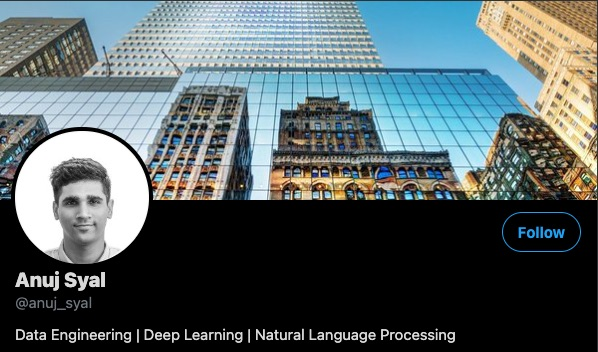

# [Anuj Syal](https://anujsyal.com/)
Data Engineering | Python | Machine Learning | Natural Language Processing | Google Cloud | AWS

     

  <b><i>You can connect with me on the following links</i></b>

[][twitter]
[][Youtube] 
[][Hashnode]

[][LinkedIn]
[][Medium]
[][Instagram]
 

<h2> 𝐇𝐞𝐥𝐥𝐨 𝐭𝐡𝐞𝐫𝐞! </h2>
<!-- 🙏 -->
 <!-- -->
 
* I am a Data Engineer
* I love Python!
* I am based in Singapore
* I have good knowledge on cloud
* I have some knowledge on building Machine Learning Models
* I have helped 30+ companies use data effectively
* I have worked with Petabytes scale of data
* I write @ TowardsDataScience
* Nowadays I am focusing on learning Natural Language Processing
* Ask me about anything, I'll be happy to help.

<table><tr><td valign="top" width="50%">

### Medium Blogs
You can find my blogs at my [Medium Page](https://syal-anuj.medium.com/): 
<!-- BLOG-POST-LIST:START -->
- [Pyspark Installation Guide](https://towardsdatascience.com/pyspark-installation-guide-140aee9aab87?source=rss-df3997c527b4------2)
- [How to NFT?](https://medium.com/geekculture/how-to-nft-71e7fbf2ca80?source=rss-df3997c527b4------2)
- [The SageMaker Saga](https://towardsdatascience.com/the-sagemaker-saga-e7ea2233388f?source=rss-df3997c527b4------2)
- [Amazon Redshift vs Google BigQuery: Battle of the Biggest OLAP Data Warehouses](https://towardsdatascience.com/amazon-redshift-vs-google-bigquery-battle-of-the-biggest-olap-data-warehouses-8311241b2c91?source=rss-df3997c527b4------2)
- [An App-solute Delight: Streamlit](https://towardsdatascience.com/an-app-solute-delight-streamlit-f9f1e7d55a85?source=rss-df3997c527b4------2)
<!-- BLOG-POST-LIST:END -->
</td>
<td valign="top" width="45%">

### My Youtube Videos
Check out my latest videos on [YouTube](https://www.youtube.com/channel/UCO8XsgcjqArk_mAd1VGBMfg):
<!-- YOUTUBE:START -->
- [Python Crypto Investment Bot Part-2](https://www.youtube.com/watch?v=8dZ0pvDqp1E)
- [Python Crypto Investment Bot](https://www.youtube.com/watch?v=ltGkO4icSP0)
- [How to get started with Non Fungible Tokens ](https://www.youtube.com/watch?v=Malw5Wg79kk)
- [Amazon Sagemaker in 11 minutes ](https://www.youtube.com/watch?v=95332cm5ROo)
- [Reached 50 Subscribers! Thank You.](https://www.youtube.com/watch?v=KYbVte_o2dA)
<!-- YOUTUBE:END -->
</td>

 

📊 Github Stats

 

 
 
 
<h3 align="center">Show some &nbsp;❤️&nbsp; by starring some of the repositories!</h3>

[twitter]: https://twitter.com/anuj_syal
[youtube]: https://www.youtube.com/channel/UCO8XsgcjqArk_mAd1VGBMfg
[Hashnode]: https://anujsyal.com
[gmail]: https://gmail.com
[linkedin]: https://www.linkedin.com/in/anuj-syal-727736101/
[Medium]: https://syal-anuj.medium.com/
[Instagram]: https://www.instagram.com/anujsyal/
